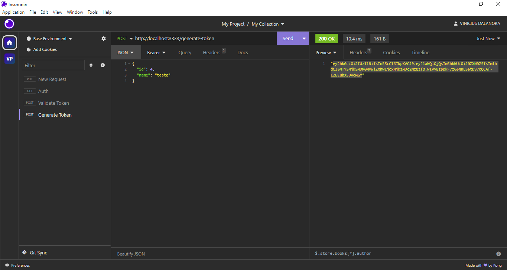
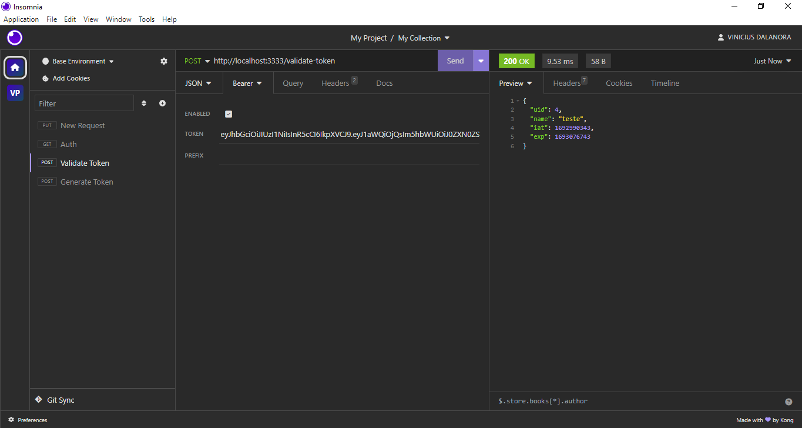
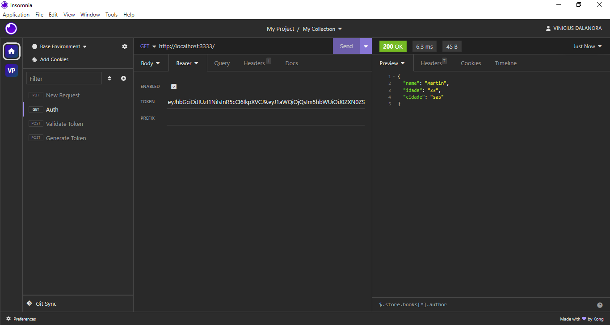
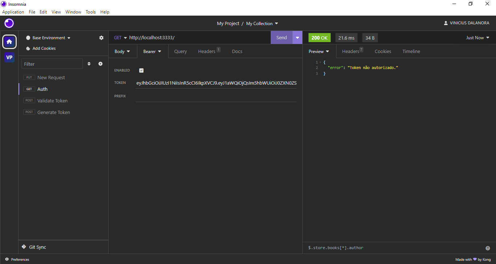

# API JWT


## Índice
- [Visão Geral](#visão-geral)
- [Implementações Futuras](#implementações-futuras)
- [Ferramentas Utilizadas](#ferramentas-utilizadas)
- [Instalação](#instalação)
- [Como Usar](#como-usar)
- [Licença](#licença)

## Visão Geral

Uma Fake API com base em typescript utilizando tokens de segurança do JWT. Rotas de geração e verificação para assim retornar o arquivo JSON esperado


## Implementações Futuras

O projeto ainda está em desenvolvimento e as próximas atualizações serão voltadas nas seguintes tarefas:

- [x] Geração e verificação dos tokens 25/08
- [ ] ... xx/xx


## Ferramentas Utilizadas
- Typescript
- Express
- NodeJS
- Biblioteca JWT
- Biblioteca Dotenv


## Instalação 

Para instalar a nossa api, siga estas etapas:

**Passo 1** - Instalar Node em sua máquina

**Passo 2** - Instalação dos recursos. Após abrir o arquivo em seu VSC, abra o terminal e use os seguintes comandos para npm ou yarn.
```
NPM - <npm i>
```
```
YARN - <yarn>
```

## Como usar

Para usar, siga estas etapas:

```
NPM - <npm start>
```
```
YARN - <yarn start>
```

Pode usar o Insomnia para seus testes.

#### Gerando token


Aqui usamos a rota de geração de token JWT dando no corpo da requisição as informações que são pedidas, no caso do exemplo, usei um número aleatório e dei um nome de "teste" como se fosse de um usuário.

#### Verificando token

Com token gerado fazemos uma verificação e vemos as suas informações.

#### Acessando JSON através do token

Jogamos o token recebido e com uma funcionalidade de autenticação que faz automaticamente a validação do usuario, recebemos a informação de dentro do nosso arquivo JSON.

#### Token inválido

Caso colocamos um token que expirou ou então que não foi gerado por nossa regra de negocio, a opreção não permitirá o acesso em nosso JSON.

## Licença

....